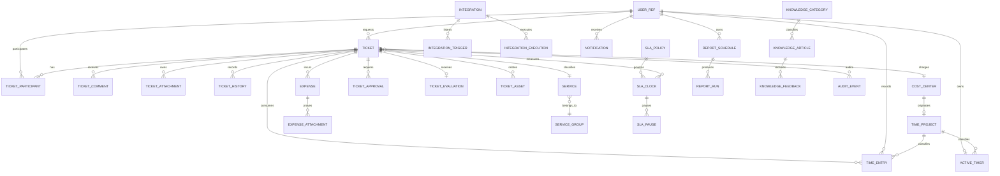

# Modelo de Domínio — Gestec Help Desk

Este é um modelo **conceitual** para futura implementação dentro do Gestec. Não é migration e não autoriza banco separado. Nomes físicos, tipos Prisma, entidades compartilhadas e exclusões devem ser reconciliados com o repositório executável.

## Convenções

- `CONFIRMED`: explícito nas Specs atuais ou no protótipo legado.
- `INFERRED`: necessário para sustentar comportamento confirmado.
- `PROPOSED`: decisão ainda não aprovada.
- Datas são instantes UTC apresentados no fuso do usuário.
- Registros operacionais usam exclusão lógica; auditoria e histórico são imutáveis.
- Usuários, ativos e cadastros corporativos são referenciados, não duplicados.

## Visão relacional

## Entidades centrais

### `UserRef` — usuário corporativo (`CONFIRMED`)

| Campo | Tipo conceitual | Obrigatório | Regra |
|-------|-----------------|-------------|-------|
| `id` | UUID/string | sim | FK para usuário Gestec |
| `displayName` | string | sim | leitura corporativa |
| `email` | email | sim | normalizado; não é secret |
| `active` | boolean | sim | inativo permanece no histórico |
| `departmentId`, `unitId` | UUID/string | não | referências corporativas |

### `Ticket` (`CONFIRMED`)

| Campo | Tipo conceitual | Obrigatório / padrão | Regra |
|-------|-----------------|----------------------|-------|
| `id` | UUID | sim | PK imutável |
| `number` | string/int | sim, gerado | único e pesquisável |
| `title` | string | sim | 3–160 caracteres |
| `description` | rich text seguro | sim | sanitização server-side |
| `type` | `TicketType` | sim | enum confirmado parcialmente |
| `status` | `TicketStatus` | sim, `NEW` | mudança validada no servidor conforme ciclo do ticket |
| `priority` | `TicketPriority` | sim | calculada ou informada conforme Spec 01.1 |
| `requesterId`, `openedById` | FK UserRef | sim | autor e beneficiário podem diferir |
| `primaryAssigneeId` | FK UserRef | não | responsável atual |
| `serviceId` | FK Service | não na criação | obrigatório após triagem |
| `costCenterId` | FK CostCenter | conforme tipo | regra em 01.1 |
| `slaPolicyId` | FK SlaPolicy | não | política efetiva registrada |
| `firstResponseAt`, `resolvedAt`, `closedAt`, `cancelledAt` | datetime | não | coerentes com o estado |
| `createdAt`, `updatedAt` | datetime | sim | auditoria básica |
| `version` | integer | sim, `1` | controle otimista |
| `deletedAt` | datetime | não | exclusão lógica autorizada |

Restrições: `number` único; datas terminais coerentes; usuário não apaga em cascata; mutações críticas geram `TicketHistory` e `AuditEvent` na mesma transação.

### Participação, arquivos e histórico

| Entidade | Campos essenciais | Regras |
|----------|-------------------|--------|
| `TicketParticipant` | `ticketId`, `userId`, `role`, `addedById`, `createdAt`, `removedAt` | par ativo único; histórico preservado |
| `TicketComment` | `id`, `ticketId`, `authorId`, `body`, `visibility`, `createdAt`, `editedAt`, `deletedAt` | sanitização server-side; interno nunca é retornado ao solicitante |
| `TicketAttachment` | `id`, `ticketId`, `commentId?`, `storageKey`, `originalName`, `mimeType`, `sizeBytes`, `checksum`, `uploadedById`, `createdAt`, `deletedAt` | URL assinada curta; validar tipo/tamanho; sem conteúdo no log |
| `TicketAsset` | `ticketId`, `assetId`, `relationType`, `linkedById`, `createdAt`, `removedAt` | referência ao Gestec Desk ou patrimônio corporativo |
| `TicketHistory` | `id`, `ticketId`, `eventType`, `fromValue`, `toValue`, `actorId`, `reason`, `metadata`, `createdAt` | append-only; metadados redigidos; ordenação por instante e ID |

### SLA

| Entidade | Campos essenciais | Regras |
|----------|-------------------|--------|
| `SlaPolicy` | `id`, `name`, `scope`, `priority?`, `serviceId?`, `firstResponseMinutes`, `resolutionMinutes`, `businessCalendarId`, `active`, `precedence` | períodos positivos; precedência explícita |
| `BusinessCalendar` (`PROPOSED`) | `id`, `name`, `timezone`, `weeklySchedule`, `active` | timezone IANA; intervalos válidos |
| `CalendarException` (`PROPOSED`) | `calendarId`, `date`, `kind`, `startAt?`, `endAt?`, `description` | feriado ou expediente especial |
| `SlaClock` (`INFERRED`) | `id`, `ticketId`, `metric`, `policyId`, `startedAt`, `dueAt`, `fulfilledAt`, `breachedAt`, `status` | uma instância efetiva por ticket/métrica/política |
| `SlaPause` (`INFERRED`) | `id`, `slaClockId`, `reason`, `startedAt`, `endedAt`, `createdById` | sem pausas ativas sobrepostas |

### Meu Tempo, projetos de apontamento, despesas e aprovação

| Entidade | Campos essenciais | Regras |
|----------|-------------------|--------|
| `TimeProject` (`CONFIRMED`, projeção conceitual) | `ref`, `kind`, `costCenterId?`, `manualProjectId?`, `name`, `code?`, `color?`, `status`, `billableDefault`, `availableToAll?`, `version` | representa exatamente um `CostCenter` ou `ManualTimeProject`; não exige tabela duplicada; tipo é interno e não aparece na interface |
| `ManualTimeProject` (`CONFIRMED`) | `id`, `name`, `normalizedName`, `code?`, `description?`, `color`, `availableToAll`, `billableDefault`, `status`, `createdById`, `archivedAt?`, `createdAt`, `updatedAt`, `version` | nome normalizado não duplica item existente conforme escopo; uso histórico impede exclusão física; natureza manual imutável |
| `ActiveTimer` | `id`, `projectRef`, `userId`, `startedAt`, `description`, `billable`, `version` | barra manual não possui ticket; projeto e descrição obrigatórios; no máximo um timer ativo por usuário; parada idempotente gera um `TimeEntry`; pausa/retomada em `GAP-046` |
| `TicketWorkPeriod` (`CONFIRMED`) | `id`, `ticketId`, `userId`, `resolutionCycleId`, `startedAt`, `endedAt?`, `pausedSeconds`, `status`, `description?`, `version` | intervalo válido exige fim posterior ao início; pausa não compõe duração; períodos pertencem a um usuário e ciclo |
| `TimeEntry` | `id`, `ticketId?`, `resolutionCycleId?`, `projectRef?`, `userId`, `startedAt`, `endedAt`, `minutes`, `description`, `billable`, `source`, `status`, `generationKey?`, `projectNameSnapshot?`, `projectCodeSnapshot?`, `version` | projeto obrigatório, exceto pendência de classificação; duração positiva; geração por ticket é idempotente; snapshots preservam leitura; ajuste/invalidação auditados |
| `HourlyRate` (`PROPOSED`/`VALIDAR`) | `id`, `scope`, `userId?`, `serviceId?`, `amount`, `currency`, `validFrom`, `validTo?` | não implementar nem inferir valores até decisão do GAP-020 |
| `Expense` | `id`, `ticketId`, `type`, `description`, `amount`, `currency`, `occurredAt`, `createdById`, `status` | valor não negativo; moeda ISO 4217 |
| `ExpenseAttachment` | `id`, `expenseId`, dados de arquivo e auditoria | mesmas proteções de `TicketAttachment` |
| `TicketApproval` | `id`, `ticketId`, `kind`, `requestedToId`, `decision`, `reason`, `requestedAt`, `decidedAt` | uma decisão final por solicitação; devolução exige justificativa |
| `TicketEvaluation` | `id`, `ticketId`, `respondentId`, `score`, `comment?`, `createdAt` | uma avaliação por ciclo concluído |

### Catálogos

| Entidade | Campos essenciais | Regra |
|----------|-------------------|-------|
| `CostCenter` | `id`, `code`, `normalizedCode`, `name`, `normalizedName`, `active`, `createdById`, `createdAt`, `updatedAt`, `version` | Gestec administra; ID interno estável e código único impedem duplicata por renomeação; ativo aparece como projeto; referenciado é inativado, não excluído |
| `ServiceGroup` | `id`, `code`, `name`, `active` | código único |
| `Service` | `id`, `serviceGroupId`, `code`, `name`, `description`, `active`, `defaultPriority?`, `slaPolicyId?` | filho não fica ativo sob pai inativo |
| `ManagedSystem` | `id`, `name`, `active` | confirmado em 01.1 |
| `InfrastructureItem` | `id`, `name`, `kind`, `active` | confirmado em 01.1 |

Registros referenciados por tickets são desativados, não removidos fisicamente.

### Integrações e notificações

| Entidade | Campos essenciais | Regras |
|----------|-------------------|--------|
| `Integration` | `id`, `name`, `kind`, `baseUrl`, `authType`, `secretRef`, `timeoutMs`, `active`, `createdById` | secret em armazenamento seguro; proteção SSRF |
| `IntegrationTrigger` | `id`, `integrationId`, `eventType`, `template`, `conditions`, `active` | template validado; sem execução arbitrária |
| `IntegrationExecution` | `id`, `integrationId`, `triggerId`, `status`, `attempt`, `startedAt`, `finishedAt`, `responseCode`, `errorCode`, `correlationId` | payload e log redigidos; ações idempotentes |
| `Notification` | `id`, `recipientId`, `ticketId?`, `type`, `channel`, `status`, `templateId`, `createdAt`, `readAt`, `sentAt` | deduplicação por evento/canal/destinatário |
| `NotificationPreference` | `userId`, `eventType`, `channel`, `enabled` | segurança obrigatória não pode ser desligada |
| `MessageTemplate` | `id`, `code`, `channel`, `subject?`, `body`, `version`, `active` | variáveis allowlist; preview e versão |

### Relatórios

| Entidade | Campos essenciais | Regras |
|----------|-------------------|--------|
| `ReportSchedule` | `id`, `ownerId`, `reportType`, `parameterSnapshot`, `recurrence`, `timezone`, `format`, `status`, `nextRunAt`, `version` | schema versionado; autorização revalidada em cada execução |
| `ReportScheduleRecipient` | `scheduleId`, `subjectType`, `subjectId`, `channel` | destinatários autorizados |
| `ReportRun` | `id`, `scheduleId`, `trigger`, `parameterSnapshot`, `status`, `startedAt`, `finishedAt`, `artifactKey?`, `expiresAt?`, `errorCode?`, `correlationId` | imutável; artefato temporário; download auditado |

### Conhecimento

| Entidade | Campos essenciais | Regras |
|----------|-------------------|--------|
| `KnowledgeArticle` | `id`, `categoryId`, `slug`, `title`, `summary`, `body`, `tags`, `audience`, `status`, `authorId`, `publishedAt`, `version` | sanitização, audiência, revisão e versionamento |
| `ArticleTicketLink` | `articleId`, `ticketId`, `relationType`, `createdById` | rastreabilidade de solução sugerida |
| `KnowledgeCategory` | `id`, `parentId?`, `name`, `slug`, `order`, `active` | slug único no mesmo pai; merge auditado |
| `KnowledgeFeedback` | `id`, `articleId`, `articleVersion`, `userId`, `helpful`, `comment?`, `createdAt`, `updatedAt` | um feedback atual por usuário/versão |
| `KnowledgeReport` | `id`, `articleId`, `reporterId`, `reason`, `comment?`, `status`, `createdAt`, `resolvedAt?` | rate limit e agrupamento de duplicatas |

### Auditoria

`AuditEvent`: `id`, `occurredAt`, `actorId`, `action`, `entityType`, `entityId`, `correlationId`, `ipHash?`, `before?`, `after?`, `reason?`.

- Append-only; acesso restrito e também auditado.
- Nunca registra token, senha, secret, corpo de anexo ou cabeçalho de autenticação.
- `before` e `after` são redigidos e limitados aos campos auditáveis.

## Enums e estados

| Enum | Valores |
|------|---------|
| `TicketType` | `REQUEST`, `IMPROVEMENT`, `CANCELLATION`, `INTERRUPTION`, `INCIDENT` |
| `CommentVisibility` | `PUBLIC`, `INTERNAL` |
| `ParticipantRole` | `REQUESTER`, `PRIMARY_ASSIGNEE`, `ASSIGNEE`, `FOLLOWER` |
| `ApprovalDecision` | `PENDING`, `APPROVED`, `RETURNED`, `REJECTED`, `CANCELLED` |
| `IntegrationKind` | `HTTP_API`, `DISCORD` |
| `SlaMetric` | `FIRST_RESPONSE`, `RESOLUTION` |
| `KnowledgeStatus` | `DRAFT`, `IN_REVIEW`, `PUBLISHED`, `ARCHIVED` (`PROPOSED`) |
| `IntegrationExecutionStatus` | `QUEUED`, `RUNNING`, `SUCCEEDED`, `FAILED`, `CANCELLED` (`INFERRED`) |
| `ReportRunStatus` | `QUEUED`, `RUNNING`, `SUCCEEDED`, `FAILED`, `EXPIRED`, `CANCELLED` (`PROPOSED`) |
| `TimeProjectKind` | `COST_CENTER`, `MANUAL` (`CONFIRMED`; somente interno) |
| `TimeProjectStatus` | `ACTIVE`, `INACTIVE`, `ARCHIVED` (`CONFIRMED`; arquivamento aplica-se ao manual) |
| `TimeEntrySource` | `TIMER`, `MANUAL`, `TICKET_FINALIZATION` (`CONFIRMED`) |
| `TimeEntryStatus` | `RECORDED`, `PENDING_CLASSIFICATION`, `ADJUSTED`, `INVALIDATED` (`CONFIRMED`/`INFERRED`) |
| `TicketWorkPeriodStatus` | `RUNNING`, `PAUSED`, `COMPLETED`, `INVALID` (`INFERRED`; pausa/retomada operacional em `VALIDAR`) |

Status conceituais do ticket: `NEW`, `TRIAGE`, `WAITING_ADJUSTMENT`, `OPEN`, `IN_PROGRESS`, `WAITING_REQUESTER`, `WAITING_APPROVAL`, `RESOLVED`, `CLOSED` e `CANCELLED`. O vocabulário final e as mudanças autorizadas permanecem em `GAP-004`.

## Cardinalidade, ownership e índices

| Relação | Cardinalidade | Comportamento recomendado |
|---------|---------------|---------------------------|
| User → Ticket | 1:N | restringir exclusão; permitir usuário inativo |
| Ticket → participantes/comentários/histórico/SLA | 1:N | operação comum é lógica; purge só excepcional |
| Ticket → avaliação | 1:0..1 por ciclo | preservar após encerramento |
| Ticket → Service/CostCenter | N:1 opcional | `RESTRICT` ou `SET NULL` somente com snapshot histórico |
| Expense → comprovantes | 1:N | exclusão lógica e auditada |
| User → active timer | 1:0..1 (`CONFIRMED`) | restrição única por usuário; parada gera apontamento na mesma transação |
| Ticket → períodos de trabalho | 1:N | cada período pertence a usuário e ciclo; períodos inválidos não entram na soma |
| Ticket → time entries | 1:N opcional | finalização gera no máximo um registro por usuário/ciclo; correção é versionada |
| TimeProject → timers/time entries | 1:N obrigatório, salvo pendência | inativar/arquivar restringe novos registros; histórico usa identidade estável e snapshot |
| CostCenter → TimeProject | 1:1 lógico | centro ativo é projetado automaticamente no seletor, sem cópia nem cadastro paralelo |
| ManualTimeProject → TimeProject | 1:1 lógico | cadastro manual é projetado no mesmo seletor sem expor o tipo |
| Integration → triggers/executions | 1:N | desativar integração; execuções imutáveis |
| ReportSchedule → runs | 1:N | agenda encerra logicamente; runs imutáveis |
| KnowledgeArticle → feedback/reports | 1:N por versão | preservar com a versão |

- Únicos: `Ticket.number`, `CostCenter.normalizedCode`, identidade de projeto manual conforme escopo, timer ativo por usuário e `TimeEntry.generationKey` quando presente.
- Índices: ticket por status, solicitante, responsável, serviço, criação e prazo SLA; períodos por `(ticketId, userId, resolutionCycleId)`; apontamentos por `(userId, startedAt)`, `(projectRef, startedAt)`, `(ticketId, resolutionCycleId)` e `billable`; histórico por `(ticketId, createdAt)`; agenda por `nextRunAt/status/owner`.
- Busca textual não expõe comentário interno.
- Mutações críticas usam transação para dado principal, histórico e outbox de notificação.
- Concorrência usa `version`; conflito retorna `409` e o estado atual.

## Pontos dependentes do Gestec

1. Tipos reais de chave e models compartilhados.
2. Cadastros corporativos de usuário, departamento, unidade, centro de custo e ativos.
3. Vocabulário final de status e matriz impacto × urgência.
4. Retenção, LGPD e purge.
5. Storage, antivírus e limites de upload.
6. Calendário de negócio e precedência de SLA.
7. Regras finais de faturamento de tickets.

Esses pontos estão rastreados em [lacunas-e-ambiguidades.md](lacunas-e-ambiguidades.md).
